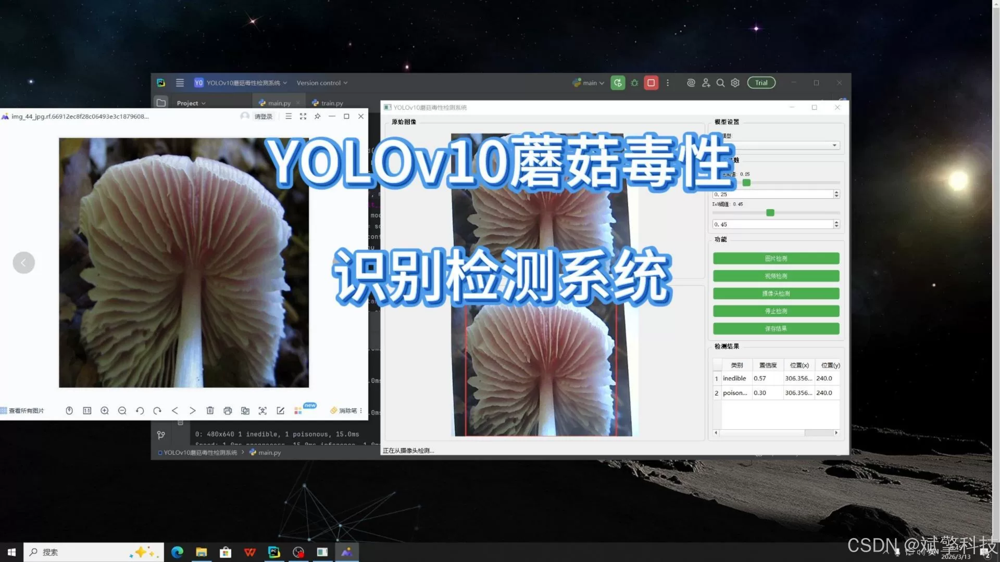
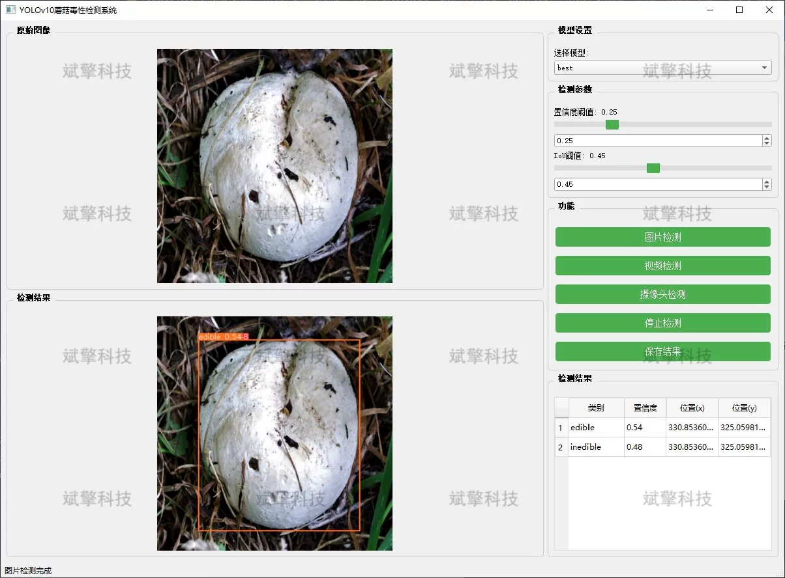
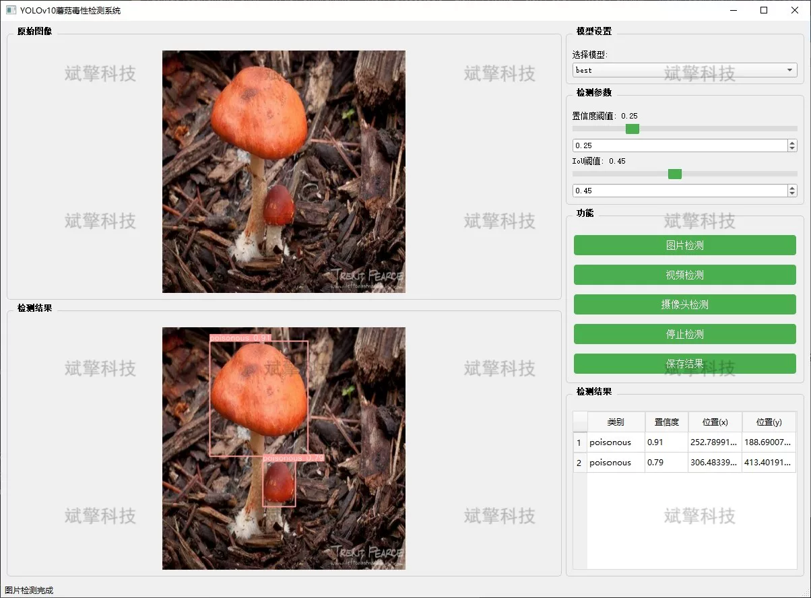
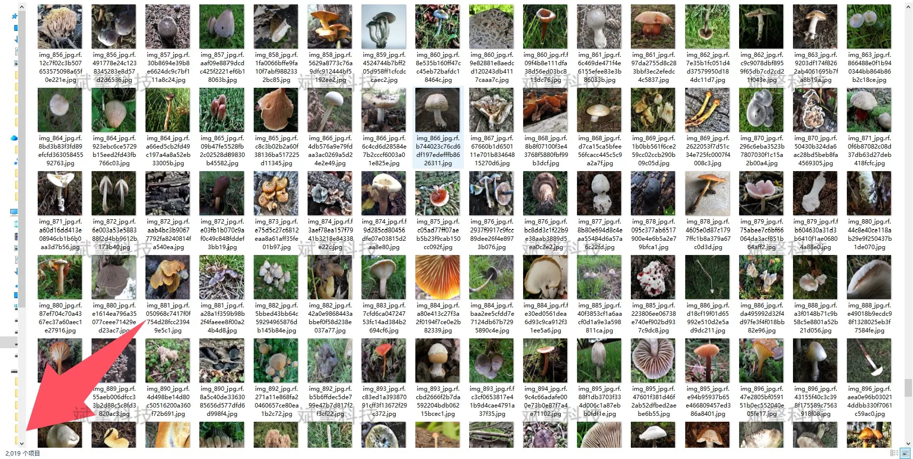
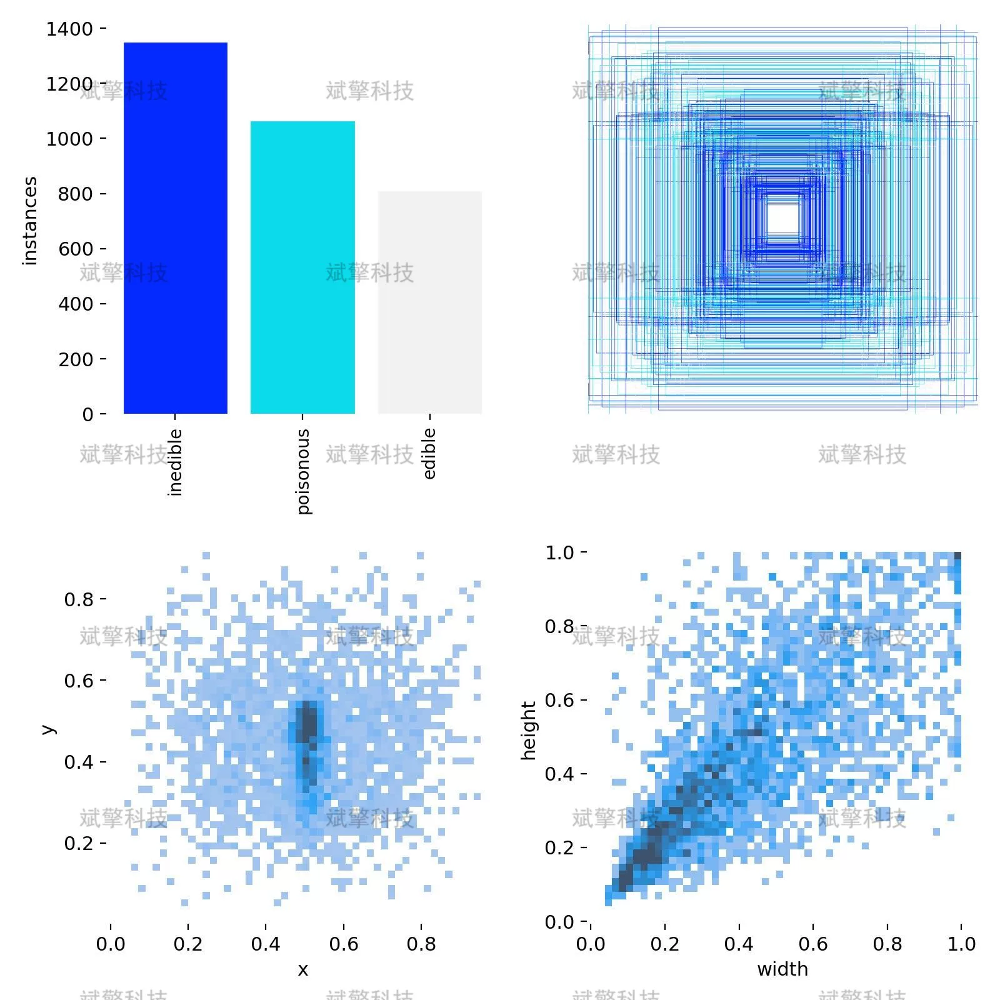
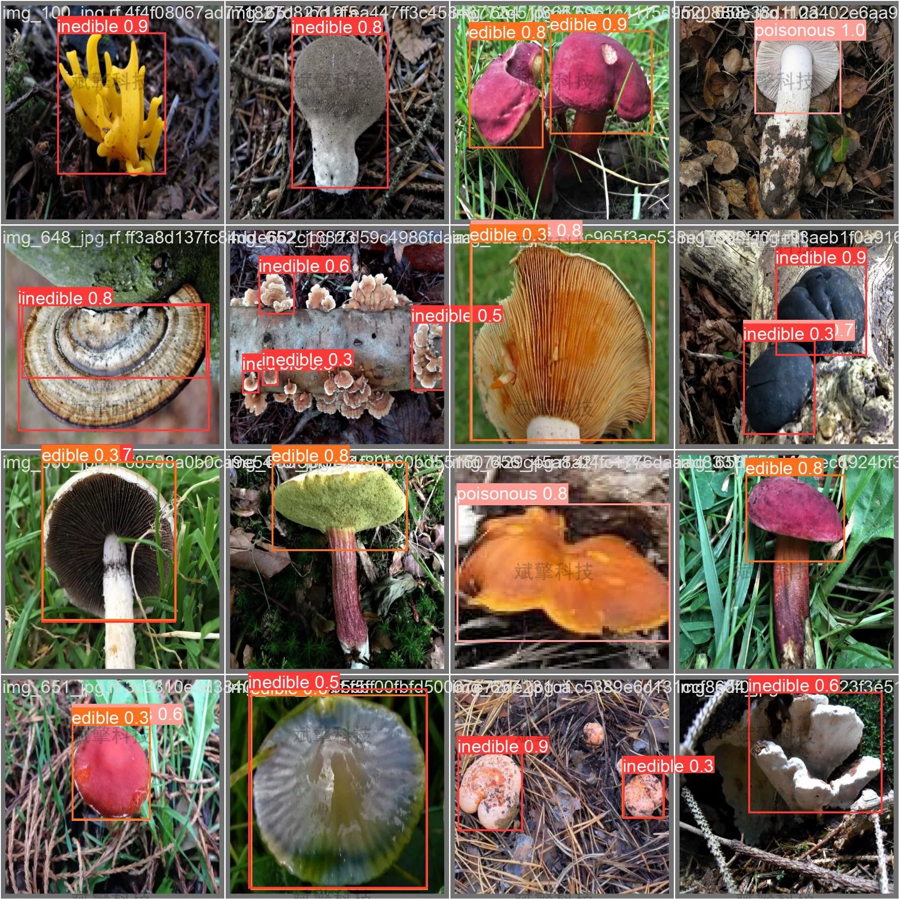

# Based on YOLOv10 deep learning for mushroom toxicity detection system (YOLOv10)

## Body

Based on the YOLOv10 deep learning algorithm, this project focuses on the field of food safety and wild mushroom poisoning prevention. It has developed a mushroom toxicity intelligent detection system based on the lightweight deep learning target detection algorithm YOLOv10. The system is designed to meet the actual needs of mushroom toxicity classification detection. It integrates three core functions: static image detection, video dynamic detection, and real-time camera detection, which can quickly and accurately identify the toxicity category of mushroom samples (non-edible, poisonous, edible), providing an intelligent solution for the quality inspection of edible fungi industry, wild mushroom picking safety warning, and food safety supervision scenarios.

System Features
✅ Image detection: Can detect images and return detection boxes and category information.
✅ Video detection: Supports video file input, detecting the situation in each frame of the video.
✅ Real-time camera detection: Connects USB cameras to achieve real-time monitoring.
✅ Parameter real-time adjustment (confidence and IoU threshold)
Dataset Introduction
Training set: 2019 images
Validation set: 576 images
Test set: 288 images

## Images

## Payment

Here is a pay link on Stripe ( https://buy.stripe.com/3cs8yP7sY87d0vu9AB ). Please contact me lonlonago@foxmail.com after funding $89, and I will send you a complete data files , thank you!

